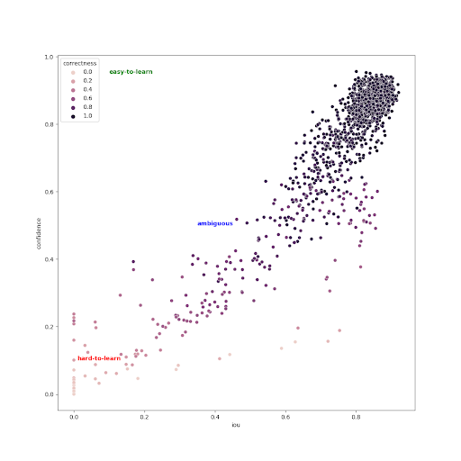
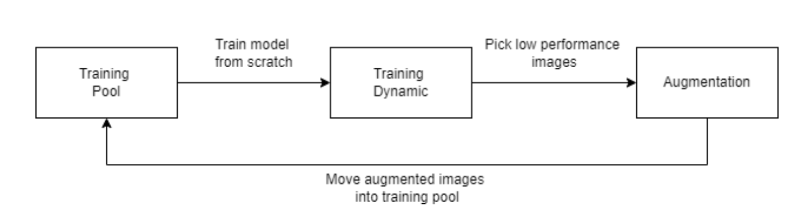
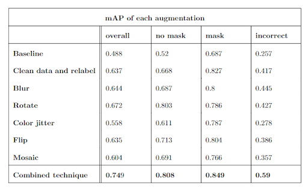

#### Table of contents
1. [Our group's approaches](#approaches)
2. [Introduction](#introduction)
3. [Dataset](#dataset)
4. [Model & Metrics](#run)
5. [How to Run](#quickstart)
   - [Quickstart](#quickstart)
   - [Install](#install)
   - [Training](#training)
   - [Evaluation](#evaluation)
   - [Detection](#detection)


<p align="center">
  <h1 align="center", id="introduction">DATA COMPETITION</h1></p>
  

 
The COVID-19 pandemic, which is caused by the SARS-CoV-2 virus, is still continuing strong, infecting hundreds of millions of people and killing millions. Face masks reduce transmission by preventing aerosols and droplets from spreading too far into the atmosphere. As a result, there is a growing demand for automated systems that can detect whether people are not wearing masks or are wearing masks incorrectly. This competition was designed in order to solve the problem mentioned above. This competition is unlike any other that has come before it. With a fixed model, participants will receive model code and configuration code that organizers use to train models. The candidate's task is to use data processing and generation techniques to improve the model's performance, then submit the dataset to the organizing team for training and evaluation on the private test set. The winner is the team with the highest score on the private test set.

## Our Group's Approaches<a name="approaches">

After analyzing our fixed model, we identified two key issues that negatively impacted performance:
- **Lack of Data Shuffling:** The model does not shuffle data during training, reducing its generalization ability.
- **Overfitting:** Training for 60 epochs on a small dataset leads to overfitting.

To address these problems, we developed an automated augmentation pipeline that both increases the dataset size to prevent overfitting and improves overall data quality.

---

### Training Dynamics & Data Mapping

Inspired by the idea of detecting hard-to-learn and easy-to-learn instances from [this article](https://arxiv.org/abs/2009.10795), we mapped our data into a 3D space defined by:

- **Correctness:** Measures whether each instance is consistently labeled correctly across epochs.
  $$
    \text{corr}_i = \frac{1}{E} \sum_{e=1}^{E} t_e
  $$

  where

  $$
    t_e = \begin{cases}
      1, & \text{if } y_e^* = y_e \\
      0, & \text{otherwise}
    \end{cases}
  $$

- **Confidence:** Instead of using the mean probability of the true label, we use the model's bounding box confidence across epochs.

- **Variability (IOU):** We use Intersection Over Union (IOU) to assess the consistency of bounding box predictions. Averaging IOU across epochs helps evaluate the stability of our model.



After training the model with raw dataset and filtering hard-to-learn images, we found:
- **Undetected Faces:** Instances where faces were missing in the labels.
- **Mismatched Orders:** Cases where the order of predicted faces did not match the original labels.

Using a subset of high-confidence images, we manually cleaned and relabeled the dataset. This process helped us better understand the data and refine the learning pattern of our fixed model.

And since our model already performed well on the "no mask" class, we focused more on augmenting the "wearing mask" and "incorrectly wearing mask" classes. This strategy reduced class imbalance and provided the model with more diverse examples. There are two data pipeline we used:
- Transferring Data Pipeline: Swap hard-to-learn cases from the validation set with easier cases from the training set. We assumed that the hard-to-learn cases in the validation dataset come from a data distribution that differs significantly from that of the training dataset. By transferring these challenging examples to the training set—and moving easier cases to the validation set—we aim to enhance the model’s predictive ability and align the distributions of both datasets. This approach not only helps the model learn from difficult examples but also mitigates out-of-distribution issues, ensuring that performance evaluations accurately reflect the model’s learning. Additionally, transferring easier instances to the validation set helps maintain the desired ratio between the two datasets.


- Generating Data Pipeline: Selectively augment only hard-to-learn and ambiguous instances based on Training Dynamics.




To alleviate the drawbacks of each pipeline, we combined two pipelines into one huge process, under the name of Augmentation pipeline, to generate with a randomly chosen mixture of augmentation techniques and then transfer data back and forth. For example, due to the shortage in incorrectly wearing mask class, Training Dynamics prone to always categorize instances of this class as hard-tolearn ones. So if we used Transferring Data pipeline only, all instances of this class are transferred to training data and remained as edge cases forever.

<center>
|   Augmentation  | Configuration|    
|-----------------|:------------:|
|      Blur      |       averaging kernel with size randomly choose from 3 to 7     |
|       Rotate       |       between -15° and 15°      |
|   Color jitter   |      Brightness=0.2, contrast=0.2, saturation=0.2, hue=0.2      |
|   Flip   |      Horizontal flip      |


### Results 


## Dataset<a name="dataset"></a>
* A dataset of 1100 images will be sent to you. This is an object detection dataset consisting of employee images at the office. 
The dataset has been assigned 3 labels by us which are no mask, mask, and incorrect mask, with the numbers 0,1,2 corresponding to each.

* The dataset has been divided into three parts for you: train, valid, and public test. We have prepared a private test to be able to evaluate the candidate's model. 
This private test will be made public after the contest ends. In the public test, you can get a basic idea of the private test. **Download the dataset** [here](https://drive.google.com/file/d/1wiu8nb7zFu9gxJRKlhs9lWO7ZyN_Tssh/view?usp=sharing)

* To improve the model's performance, you can re-label it and employ data augmentation to generate more images (up to 3000).

The number of each label in each part is shown below:
|                 |    No mask   |     Mask    |incorrect mask| 
|-----------------|:------------:|:-----------:|:------------:|
|      Train      |      308     |     882     |      51      |
|       Val       |      97      |     190     |      9       |
|   Public_test   |      47      |     95      |      13      |

## Model & Metrics <a name="model"></a>
* The challenge is defined as object detection challenge. In the competition,
We use [YOLOv5s](https://github.com/ultralytics/yolov5/releases) and also use a pre-trained model
trained with easy mask dataset to greatly reduce training time.
* We fix all [hyperparameters](config/hyps/hyp_finetune.yaml) of the model
and **do not use any augmentation tips** in the source code.
Therefore, each participant need to build the best possible dataset by relabeling
incorrect labels, splitting train/val, augmentation tips, adding new dataset, etc.

* In training process, Early Stopping method with patience setten to 100 iterations
is used to keep track of validation set's wAP@0.5. Detail about wAP@0.5 metric:
<p align="center">
wAP@0.5 = weighted_AP@0.5 = 0.2 * AP50_w + 0.3 * AP50_nw + 0.5 * AP50_wi
</p>

   Where, </br>
   AP50_w: AP50 on valid mask boxes </br>
   AP50_nw: AP50 on non-mask boxes </br>
   AP50_wi: AP50 on invalid mask boxes </br>

* The wAP@0.5 metric is also used as the main metric
to evaluate participant's submission on private testing set.


## How to Run<a name="run"></a>
### QuickStart <a name="quickstart"></a>
Click the image below 

<a href="https://colab.research.google.com/drive/18VZqW9X2bI2Os28BhIyE4YqkFC9FKRrf?usp=sharing" target="_blank">
  
</a>

### Install requirements <a name="install"></a>

* All  requirements are included in [requirements.txt](https://github.com/fsoft-ailab/Data-Competition/blob/main/requirements.txt)


* Run the script below to clone and install all requirements


```angular2html
git clone https://github.com/fsoft-ailab/Data-Competition
cd Data-Competition
pip3 install -r requirements.txt
```

### Training <a name="training"></a>


* Put your dataset into the Data-Competition folder.
The structure of dataset folder is followed as folder structure below:
```bash
folder-name
├── images
│   ├── train
│   │   ├── train_img1.jpg
│   │   ├── train_img2.jpg
│   │   └── ...
│   │   
│   └── val
│       ├── val_img1.jpg
│       ├── val_img2.jpg
│       └── ...
│   
└── labels
    ├── train
    │   ├── train_img1.txt
    │   ├── train_img2.txt
    │   └── ...
    │   
    └── val
        ├── val_img1.txt
        ├── val_img2.txt
        └── ...

```
* Change relative paths to train and val images folder in `config/data_cfg.yaml` [file](config/data_cfg.yaml)

* [train_cfg.yaml](config/train_cfg.yaml) where we set up the model during training. 
You should not change such hyperparameters because it will result in incorrect results. The training results are saved
in the `results/train/<version_name>`.
* Run the script below to train the model. Specify particular name to identify your experiment:
```angular2html
python3 train.py --batch-size 64 --device 0 --name <version_name> 
```
`Note`: If you get out of memory error, you can decrease batch-size to multiple of 2 as 32, 16.

### Evaluation <a name="evaluation"></a>
* Run script below to evaluate on particular dataset.
* The `--task`'s value is only one of `train, val, or test`, respectively
evaluating on the training set, validation set, or public testing set.
* `Note`: Specify relative path to images folder which
you evaluate in `config/data_cfg.yaml` [file](config/data_cfg.yaml).

```angular2html
python3 val.py --weights <path_to_weight> --task test --name <version_name> --batch-size 64 --device 0
                                                 val
                                                 train
```
* Results are saved at `results/evaluate/<task>/<version_name>`.

### Detection <a name="detection"></a>

* You can use this script to make inferences on particular folder

* Results are saved at `<save_dir>`.
```angular2html
python3 detect.py --weights <path_to_weight> --source <path_to_folder> --dir <save_dir> --device 0
```

* You can find more default arguments at [detect.py](https://github.com/fsoft-ailab/Data-Competition/blob/main/train.py)

## References
* Our source code is based on Ultralytics's implementation: https://github.com/ultralytics/yolov5
* ScaledYOLOV4: https://github.com/WongKinYiu/ScaledYOLOv4
